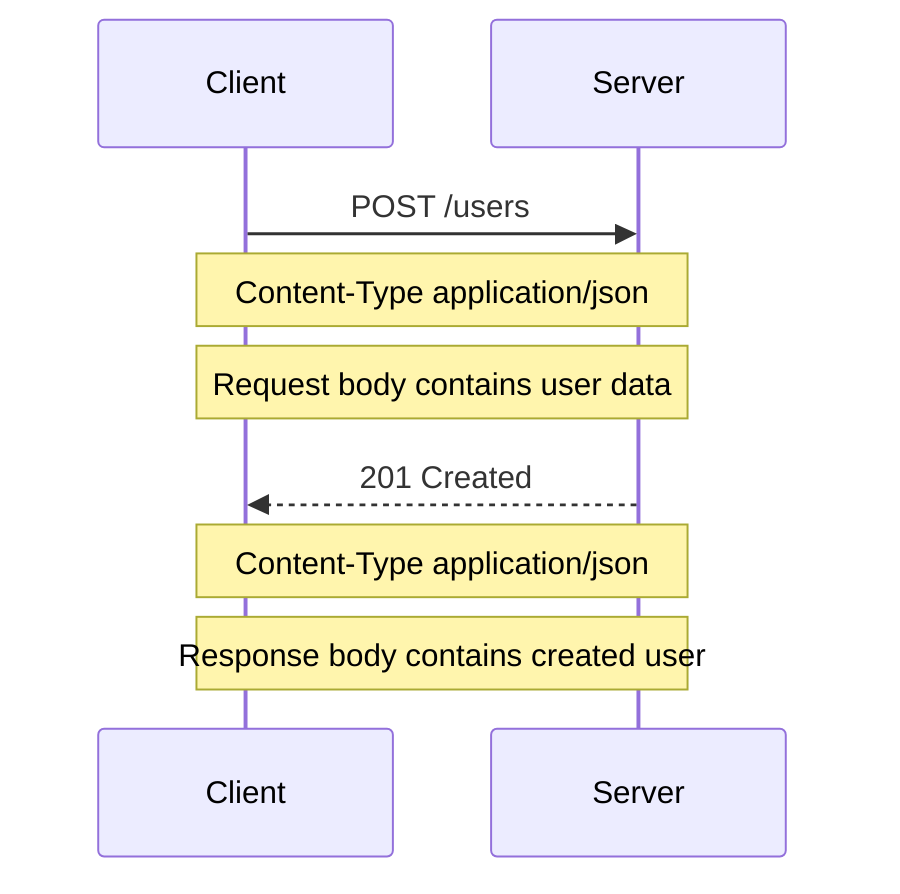
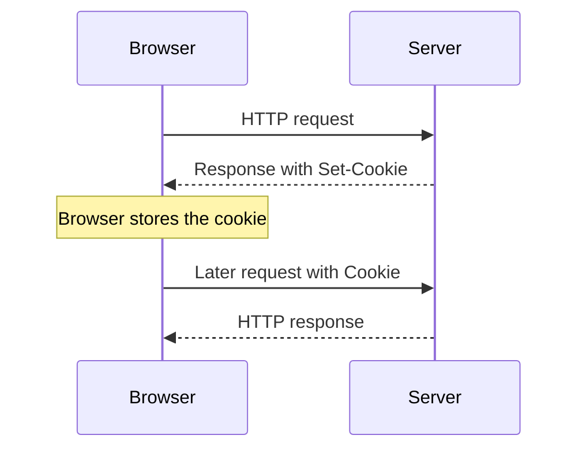

# Level 2

## Table of Contents: HTTP

- [Transferring Data in Requests and Responses](#transferring-data-in-requests-and-responses)
- [Carrying Data Across Requests](#carrying-data-across-requests)

**HTTP Level 2** builds on **HTTP Level 1** and the cookie concepts introduced in **Web Storage**. Level 1 established the request response model and the basic roles of methods, status codes, headers, and message bodies. This level focuses on how application data is placed within HTTP communication and how relevant values can participate in later requests.

## Transferring Data in Requests and Responses

**HTTP Level 1** introduced headers and message bodies as parts of HTTP requests and responses. At this level, the focus is on how application data is represented and placed within those messages. Depending on its purpose, data can appear in the URL, in HTTP headers, or in the message body.

Data used to describe or refine what is being requested can be included in the URL through query parameters. Query parameters were introduced in **URLs Level 1**, and an HTTP request carries them as part of its request target. For example, the following request carries `category=books` in the requested URL.

```http
GET /products?category=books HTTP/1.1
Host: example.com
```

Because query parameters are part of the URL, they are useful for values associated with the requested resource or operation. Data that represents submitted content is commonly carried separately in the request body.

```http
POST /users HTTP/1.1
Host: example.com
Content-Type: application/json

{"name": "Ada"}
```

Here, the body carries the submitted user data, while `Content-Type: application/json` tells the recipient how that data is represented. HTTP bodies are not limited to JSON. HTML form data can use `application/x-www-form-urlencoded`, while forms that transfer files commonly use `multipart/form-data`. More information about common media types is available in the [MDN guide to MIME types](https://developer.mozilla.org/en-US/docs/Web/HTTP/Guides/MIME_types).

The same principle applies to responses. A server can return a representation in the response body and use `Content-Type` to describe how that representation should be interpreted.

```http
HTTP/1.1 200 OK
Content-Type: application/json

{"id": 42, "name": "Ada"}
```

A different response could carry HTML, plain text, an image, or another representation. The HTTP message model remains the same while the representation being transferred changes.

Headers provide another location for information that participates in an HTTP exchange. Unlike a message body, which commonly carries the main submitted or returned content, headers carry information used to process or interpret the message. `Content-Type` identifies the representation being transferred, while `Content-Length` can describe the size of the message body in bytes when that header is present. Individual headers and their purposes are documented in the [MDN HTTP headers reference](https://developer.mozilla.org/en-US/docs/Web/HTTP/Reference/Headers).

These locations can work together in a single exchange.



The same exchange can be represented as HTTP messages.

```http
POST /users HTTP/1.1
Host: example.com
Accept: application/json
Content-Type: application/json

{"name":"Ada"}
```

The server can respond with the result and the created representation.

```http
HTTP/1.1 201 Created
Content-Type: application/json

{"id":42,"name":"Ada"}
```

The important idea is not simply that HTTP messages contain targets, headers, and bodies, since those parts were introduced in **HTTP Level 1**. At this level, the important distinction is **what information each location carries**. The request target can contain values associated with what is being requested, headers carry information used to process or interpret the message, and bodies carry submitted or returned representations.

These mechanisms explain how information is transferred within an individual HTTP exchange. HTTP remains stateless between separate exchanges, so applications that need continuity must carry relevant values into later requests.

## Carrying Data Across Requests

**HTTP Level 1** introduced HTTP as stateless, while **Web Storage** introduced cookies and the browser rules that control their storage and behavior. From the HTTP perspective, the next step is to understand how stored cookie values participate in responses and later requests.

A server can create or update a cookie by including `Set-Cookie` in an HTTP response. The browser evaluates the cookie according to its cookie rules and stores it when appropriate.

```http
HTTP/1.1 200 OK
Set-Cookie: clientId=abc123
```

When the stored cookie applies to a later request, the browser can include its name and value in the `Cookie` request header.

```http
GET /account HTTP/1.1
Host: example.com
Cookie: clientId=abc123
```

The complete interaction shows how a value can move from an HTTP response into browser cookie storage and then participate in a later HTTP request.



HTTP defines how cookie information is carried, but it does not define what `clientId=abc123` means to the application. The value could represent an identifier, session identifier, token, preference, or another application defined value. The application determines what the value means and how it is processed. More detailed syntax for server supplied cookies is documented in the [MDN `Set-Cookie` reference](https://developer.mozilla.org/en-US/docs/Web/HTTP/Reference/Headers/Set-Cookie).

Cookies are not the only way to carry application defined values in later requests. A client can also place a value directly in an HTTP header. A common example is the `Authorization` header using the `Bearer` authentication scheme.

```http
GET /account HTTP/1.1
Host: example.com
Authorization: Bearer eyJhbGciOi...
```

Here, `Bearer` identifies the authentication scheme and the following value is the token being carried. HTTP defines how the authorization information is represented in the request, while the application and authentication system determine what the token represents and how it is validated. Bearer tokens can use different token formats, and topics such as JWTs, access tokens, and authentication strategies belong in later material. More information about the HTTP header itself is available in the [MDN `Authorization` header reference](https://developer.mozilla.org/en-US/docs/Web/HTTP/Reference/Headers/Authorization).

Cookies and explicitly supplied headers therefore illustrate different ways of carrying values. Applicable cookies are attached to requests by the browser according to cookie rules, while an `Authorization` header is normally supplied explicitly by the client or application. The value itself is separate from the mechanism used to carry it. A token, for example, can be carried in an `Authorization` header or stored as a cookie value and later carried through the `Cookie` header, depending on the application design.

The important distinction is between **the application data being carried** and **the HTTP mechanism carrying it**. An identifier, session identifier, token, or preference is an application defined value. Query parameters, message bodies, cookies, and other headers provide locations or mechanisms through which values can participate in HTTP communication. HTTP defines how the information is transferred, while the application determines what that information means.

With this distinction established, later topics can introduce sessions, JWTs, access tokens, and authentication strategies without confusing those concepts with the HTTP mechanisms used to carry their values.
