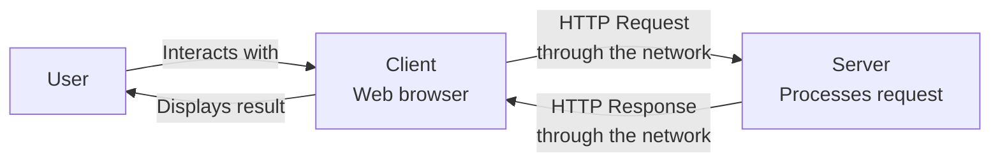
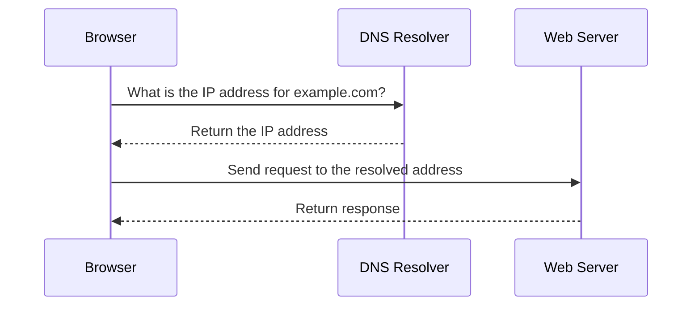
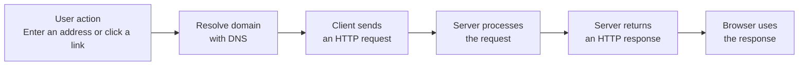

# Level 1

## Table of Contents: Web Architecture and Communication

- [Client Server Model](#client-server-model)
- [DNS Resolution](#dns-resolution)
- [Request Response Lifecycle](#request-response-lifecycle)

**Web Architecture and Communication Level 1** introduces the basic communication model behind web applications. The focus is on the roles of clients and servers, how a browser finds the server for a domain name, and how a user action becomes a request that produces a response.

## Client Server Model

Web applications depend on communication between separate systems. This communication follows the **client server model**, in which a **client** sends a request and a **server** receives the request, processes it, and returns a response.

In web applications, the client is commonly a web browser, although mobile applications and other programs can also act as clients. When a user opens a page, clicks a link, or submits a form, the client may request HTML, images, application data, or other resources. Web clients and servers commonly exchange these requests and responses using **HTTP (Hypertext Transfer Protocol)**. For now, it is enough to know that HTTP provides the rules for this communication. How HTTP requests and responses are structured and processed is covered in **HTTP Level 1**.

The server decides how to handle each request. It might return a stored file directly, or it might run application logic and retrieve data before creating the response. The browser then uses the returned information to update what the user sees.

!!! info "Client and Server Describe Roles"

    The words **client** and **server** describe roles in a communication process. A browser usually acts as a client because it initiates web requests. A server application waits for requests and responds to them.

The client does not need direct access to the server's internal code or stored data. Instead, the systems communicate through defined requests and responses. This separation allows the client and server to be developed and operated independently. Before this communication can begin, the client needs to determine where the server can be reached. The next section explains how **DNS** connects a human-readable domain name to the IP address used to locate the destination.

## DNS Resolution

**DNS (Domain Name System)** maps domain names to IP addresses. A domain name such as `example.com` is convenient for people to use, while an **IP address** identifies a destination that devices can use for network communication. An IPv4 address can look like `93.184.216.34`. The process of finding the IP address associated with a domain name is called **DNS resolution**.

When a user enters a web address, the browser and operating system can first use previously **cached** (temporarily stored) DNS information. If the required address is not already available, a DNS resolver is queried. The resolver may need to ask several DNS servers on the client's behalf before it can return the appropriate IP address. After the domain name has been resolved, the browser can continue communicating with the destination server.

!!! note "DNS Finds the Destination"

    DNS does not return the requested web page. Its role in this process is to help the client find the network address associated with the domain name. The web request is sent after that destination has been resolved.

If DNS cannot resolve the domain name, the browser cannot locate the destination through that name and may display an error. When resolution succeeds, the client can communicate with the server. The next section brings these ideas together by following the complete **request response lifecycle** from a user action to the result returned by the server.

## Request Response Lifecycle

The **request response lifecycle** describes the basic sequence that occurs when a client requests something from a server and receives the result.

The process begins with a user action, such as entering a web address or clicking a link. If the browser needs to resolve a domain name, DNS helps determine the destination. The browser can then send an **HTTP request** to the server. The server receives the request and decides how to handle it. Processing may be simple, such as returning a stored file, or it may involve application logic and data retrieval. After processing is complete, the server sends an **HTTP response** back to the client.

The browser receives the HTTP response and uses it according to the type of data returned. Loading a web page usually requires more than one HTTP request. An initial HTTP response may contain HTML that refers to additional resources such as images, CSS, or JavaScript, causing the browser to send further HTTP requests to retrieve them.

!!! example "One Page Can Require Multiple Requests"

    Suppose a user opens `https://example.com` and the returned HTML refers to an image. The `https://` part indicates secure web communication and is covered later in **Web Security Level 1**.

    1. The browser determines the destination associated with `example.com`.
    2. The browser sends an HTTP request for the page.
    3. The server processes the request and returns an HTTP response containing HTML.
    4. The browser reads the HTML and discovers that the page also requires an image.
    5. The browser sends another HTTP request for the image.
    6. The server returns an HTTP response containing the image, which the browser can display as part of the page.

If the destination server cannot be reached or does not respond, the HTTP request cannot complete normally and the browser may display an error. At this point, the basic architecture of web communication is established. The client and server define the communicating roles, DNS helps the client locate the destination, and the request response lifecycle connects these parts into a complete interaction. The next module examines **URLs**, which define the addresses used to identify resources on the web.
