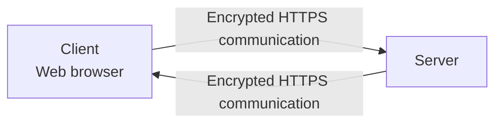
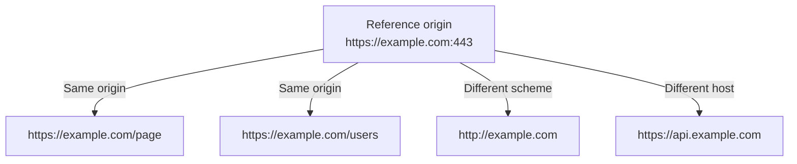

# Level 1

## Table of Contents: Web Security

- [What Is Web Security](#what-is-web-security)
- [HTTP and HTTPS](#http-and-https)
- [TLS and Encryption](#tls-and-encryption)
- [Server Identity and Certificates](#server-identity-and-certificates)
- [Origins and the Same Origin Policy](#origins-and-the-same-origin-policy)
- [Cross Origin Requests and CORS](#cross-origin-requests-and-cors)

**Web Security Level 1** introduces the security concepts that affect communication between browsers and servers. The focus is on how HTTPS protects HTTP communication, how TLS provides encryption and server authentication, and how browsers use origins to control interactions between websites.

## What Is Web Security

Web applications exchange information across networks, which means communication can be exposed to security risks if it is not properly protected. **Web security** includes the technologies and browser rules used to protect this communication and reduce unauthorized access to data and resources. At this **Web Security Level 1**, the focus is on two different parts of web security. The first is protecting data while it travels between a client and server. The second is understanding how browsers separate websites according to their origins.

Protecting communication begins with the secure form of HTTP used by modern websites. The next section introduces HTTPS and how it changes the protection of HTTP communication.

## HTTP and HTTPS

**HTTPS (Hypertext Transfer Protocol Secure)** is HTTP communication protected by **TLS (Transport Layer Security)**. The HTTP concepts from the previous module still apply. Clients send HTTP requests and servers return HTTP responses, but HTTPS protects that communication while it travels across the network. A URL using HTTPS begins with the `https` scheme, such as `https://example.com`. Modern web applications normally use HTTPS because it helps prevent other parties on the network from reading or modifying information exchanged between the client and server.

HTTPS describes secure HTTP communication, while TLS provides the security mechanisms underneath it. The next section introduces the role of TLS, including encryption and integrity protection.

## TLS and Encryption

**TLS (Transport Layer Security)** is the protocol used to secure communication between a client and server. One of its main responsibilities is **encryption**, which transforms transmitted data so that parties without the required cryptographic information cannot simply read it while it travels across the network. TLS also helps protect the **integrity** of communication, allowing the communicating systems to detect unauthorized changes to protected data during transmission. HTTPS therefore provides more than hidden content. It creates a protected channel for HTTP communication.

TLS replaced the older **SSL (Secure Sockets Layer)** protocols. The term SSL is still sometimes encountered in documentation and conversation, but modern HTTPS uses TLS. Encryption protects the data being exchanged, but the client also needs a way to establish that it is communicating with the intended server. The next section introduces server identity and digital certificates.

## Server Identity and Certificates

TLS uses **digital certificates** as part of the process of authenticating a server. A certificate associates information about a server with cryptographic information that the browser can verify through trusted certificate authorities. This helps the browser establish that the server presenting the certificate is authorized for the domain being visited. A valid HTTPS connection therefore provides important protections for data in transit, but it does not mean that every website using HTTPS is trustworthy or safe in every other respect. HTTPS protects the connection between the client and server rather than guaranteeing the quality or intentions of the application itself. For additional background, see the [MDN HTTPS glossary entry](https://developer.mozilla.org/en-US/docs/Glossary/HTTPS) and the [MDN TLS glossary entry](https://developer.mozilla.org/en-US/docs/Glossary/TLS).

Secure transport protects communication across the network, but browsers also need rules that control how content from one website can interact with another. These rules begin with the concept of an origin, which is introduced in the next section.

## Origins and the Same Origin Policy

An **origin** is determined by the **scheme**, **host**, and **port** of a URL. Two URLs have the same origin only when these components match. For example, `https://example.com/page` and `https://example.com/users` have the same origin because their scheme, host, and effective port are the same. A change to the scheme, host, or port can create a different origin.

The following diagram compares URLs with a reference origin and shows which changes create a different origin.

The **same origin policy** is a browser security mechanism that restricts how documents or scripts from one origin can interact with resources from another origin. These restrictions help prevent a website from freely reading sensitive information belonging to another website that a user may also be visiting. The [MDN Same-origin policy guide](https://developer.mozilla.org/en-US/docs/Web/Security/Defenses/Same-origin_policy) provides a more detailed reference when needed.

The same origin policy establishes restrictions between different origins, but web applications sometimes need legitimate communication across those boundaries. The next section introduces CORS as a mechanism for controlling this type of access.

## Cross Origin Requests and CORS

A **cross origin request** is a request involving a resource from a different origin. Browsers can send many types of cross origin requests, but the same origin policy can restrict whether scripts are allowed to access the returned response. **CORS (Cross-Origin Resource Sharing)** is an HTTP based mechanism that allows a server to indicate which other origins are permitted to access its resources from browser scripts. It uses HTTP headers to communicate these permissions. CORS does not disable browser security. Instead, it provides a controlled way for servers to allow specific cross origin access.

At Level 1, the important distinction is that the **same origin policy provides the browser restriction**, while **CORS provides a controlled way for servers to permit certain cross origin interactions**. Detailed CORS headers, preflight requests, credentials, and configuration belong in a later level. The [MDN CORS guide](https://developer.mozilla.org/en-US/docs/Web/HTTP/Guides/CORS) provides a complete reference when those details are needed.

With HTTPS, TLS, origins, the same origin policy, and CORS established, the main Level 1 web security concepts are connected. HTTPS protects HTTP communication while it travels across the network, while browser origin rules help control how web applications interact with resources belonging to other origins.
