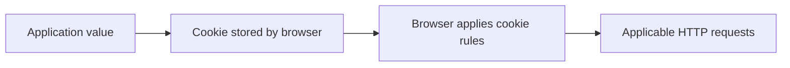
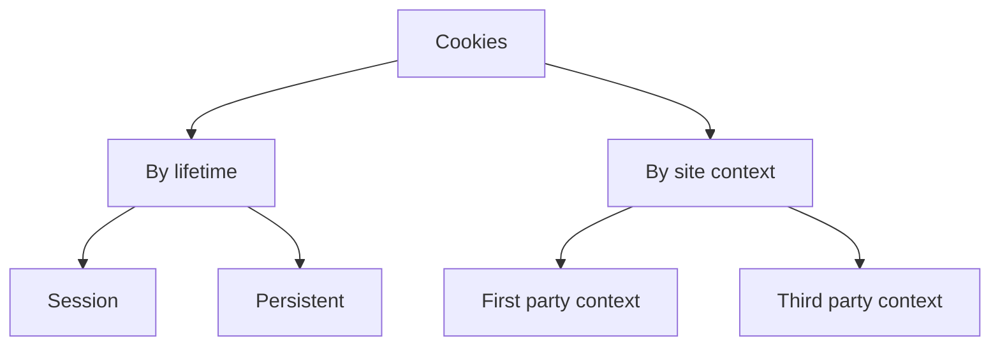
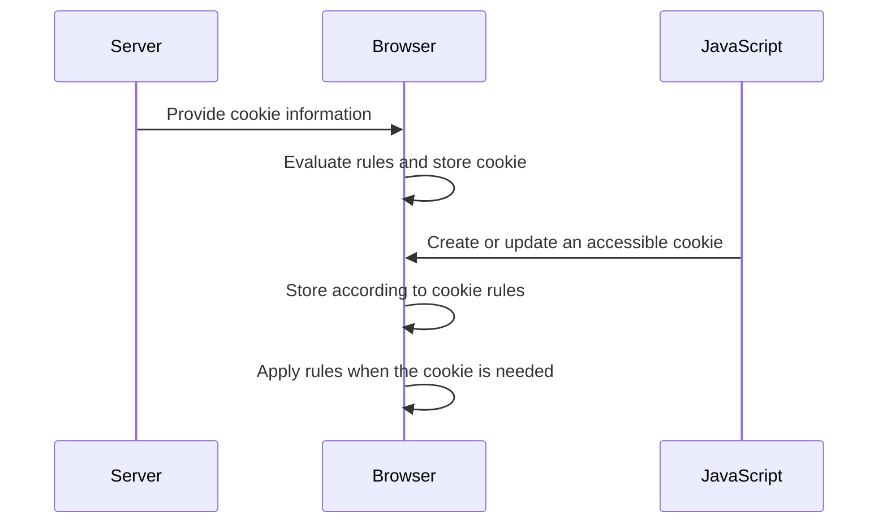
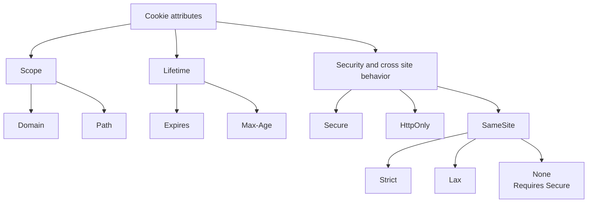

# Cookies

## Table of Contents: Cookies

- [What Are Cookies](#what-are-cookies)
- [Types of Cookies](#types-of-cookies)
- [Creating and Storing Cookies](#creating-and-storing-cookies)
- [Cookie Attributes and Browser Policies](#cookie-attributes-and-browser-policies)

Cookies are a browser storage mechanism for small pieces of data associated with websites. They can store application defined values such as preferences and identifiers. Unlike `localStorage` and `sessionStorage`, applicable cookies can also participate in HTTP communication because the browser can include them with requests.

This topic introduces cookies from the **browser storage perspective**, including what they store, how they are classified and created, and how attributes and browser policies control their behavior. The HTTP message details of `Set-Cookie` and `Cookie` are explored later in **HTTP Level 2**.

## What Are Cookies

A **cookie** is a small name and value pair stored by the browser together with rules that control its behavior. Its value can represent a preference, identifier, session identifier, token, or another small piece of application defined information. The cookie mechanism stores and manages the value, while the application determines what that value means.

Cookies differ from other browser storage mechanisms because the browser can automatically include applicable cookies with HTTP requests. This makes them useful when stored information needs to participate in communication with a server. For example, a language preference can help an application select localized content, while an identifier can help associate multiple interactions with the same context. The [MDN guide to HTTP cookies](https://developer.mozilla.org/en-US/docs/Web/HTTP/Guides/Cookies) provides a broader reference for cookie behavior and common uses.



This ability to participate in HTTP communication, together with the rules controlling when cookies are stored and used, distinguishes cookies from storage mechanisms intended primarily for client side data. Cookies can also be categorized according to their lifetime and the context in which they operate, which provides a useful foundation before examining how they are created.

## Types of Cookies

By lifetime, cookies can be **session cookies** or **persistent cookies**. A session cookie normally lasts for the browser session, while a persistent cookie can remain stored across browser sessions until its configured lifetime ends or it is removed. Cookies can also be described as **first party** or **third party** according to the site context in which they operate. First party cookies are used in the context of the site the user is visiting, while third party cookies involve another site, often through embedded content or external services.



These classifications can overlap. A cookie can, for example, be both persistent and used in a first party context. Authentication, preferences, shopping features, and analytics instead describe possible **uses** of cookies rather than separate cookie types. Third party cookie behavior is increasingly affected by browser privacy features, and the [MDN guide to third party cookies](https://developer.mozilla.org/en-US/docs/Web/Privacy/Guides/Third-party_cookies) provides more detail about these changing restrictions. The classifications describe what kind of cookie is being used, while cookie creation and storage explain how that cookie becomes available to the browser.

## Creating and Storing Cookies

Cookies can be created through a server response or through client side JavaScript. When a server provides cookie information through HTTP communication, the browser evaluates the associated rules and stores the cookie when it is accepted. JavaScript can also create or update accessible cookies through the `document.cookie` API when browser policies and cookie attributes allow it. The [MDN documentation for `document.cookie`](https://developer.mozilla.org/en-US/docs/Web/API/Document/cookie) provides the complete API syntax and browser behavior.

```javascript
document.cookie = "theme=dark; Path=/";
```

Both approaches use the browser's cookie storage, although their capabilities differ. JavaScript cannot create a cookie with the `HttpOnly` attribute and cannot read an `HttpOnly` cookie. Once a cookie is stored, the browser manages it according to its attributes and can later make it available when the relevant rules are satisfied. The exact HTTP headers used by servers and browsers to exchange cookie information are covered later in **HTTP Level 2**.

The sequence below focuses on browser storage rather than HTTP message syntax.



Creating a cookie therefore establishes more than a stored name and value. The browser also needs rules describing the cookie's scope, lifetime, script access, and behavior in different contexts. Those rules are expressed through cookie attributes and browser policies.

## Cookie Attributes and Browser Policies

A cookie contains a **name**, a **value**, and optional **attributes** that control its scope, lifetime, access, and behavior in different browser contexts. In `session_id=abc123`, `session_id` is the name and `abc123` is the value.

```text
session_id=abc123; Path=/; HttpOnly; Secure; SameSite=Lax
```

`Domain` and `Path` control scope. `Domain` determines the hosts to which a cookie can be sent within its permitted domain scope. When `Domain` is omitted, the cookie is host only and is returned only to the host that set it. `Path` limits the request paths for which the cookie applies. For example, `Path=/api` limits the cookie to matching paths under `/api`.

`Expires` and `Max-Age` control persistence. When neither is defined, the cookie is normally a **session cookie**. When a lifetime is defined, the cookie becomes a **persistent cookie** and can remain stored beyond the current browser session until its configured lifetime ends or it is removed.

`Secure`, `HttpOnly`, and `SameSite` affect security and cross site behavior. `Secure` restricts a cookie to secure connections. `HttpOnly` prevents JavaScript from accessing the cookie through `document.cookie` while still allowing the browser to use it according to its request rules. `SameSite` controls cookie behavior in certain cross site contexts. `Strict` provides the strongest same site restriction, `Lax` permits cookies in some cross site situations including certain top level navigations, and `None` permits cross site sending and must be combined with `Secure` in modern browsers. The [MDN `Set-Cookie` reference](https://developer.mozilla.org/en-US/docs/Web/HTTP/Reference/Headers/Set-Cookie) documents these attributes in greater technical detail.



Modern browsers also apply policies beyond individual cookie attributes. Depending on the browser and context, third party cookie access can be restricted or partitioned, storage limits can apply, and embedded or cross site content can receive additional privacy protections. These policies continue to evolve, so applications should not assume identical third party cookie behavior across browsers. For practical recommendations on configuring security related attributes, students can continue with the [MDN secure cookie configuration guide](https://developer.mozilla.org/en-US/docs/Web/Security/Practical_implementation_guides/Cookies).

!!! warning "Cookie security"

    Cookie attributes provide important protections, but they do not make an application secure by themselves. Appropriate configuration depends on how the cookie is used and on the security requirements of the application.

Together, cookie attributes and browser policies determine where a cookie applies, how long it remains available, whether scripts can access it, and under which conditions it can participate in browser communication. This completes the browser storage view of cookies. **HTTP Level 2** builds on this foundation by showing how stored cookies participate in HTTP responses and later requests.
