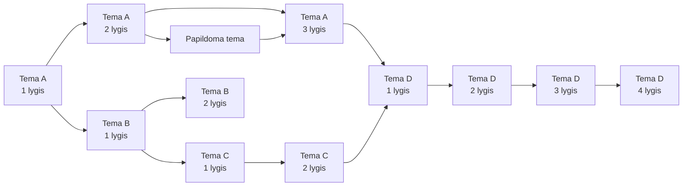

# Idėja

Prieš pasakodamas apie šios mokymo medžiagos idėją, noriu pradėti nuo nedidelės priešistorės apie „Old School RuneScape“ – žaidimą, kuriame tyrinėji pasaulį, atlieki įvairias užduotis ir po truputį tobulini savo veikėjo įgūdžius. Pirmą kartą prisijungęs prie žaidimo savo kelionę pradedi Tutorial Island, kur dar nelabai žinai, kas tavęs laukia ir ką apskritai galėsi veikti. Čia žaidimas po truputį supažindina su pagrindiniais dalykais. Išmoksti valdyti savo veikėją, bendrauti su kitais veikėjais ir atlikti pirmuosius veiksmus. Pagauni pirmąją žuvį, ją išsikepi, nukerti medį, įkuri ugnį, iškasi pirmąją rūdą, išbandai kalvystę ir galiausiai susipažįsti su kovos pagrindais. Kiekviename žingsnyje tau parodoma tik tiek, kiek tuo metu reikia, o tada ateina tavo eilė tai išbandyti pačiam.

Baigęs Tutorial Island patenki į Lumbridge. Tai pirmoji vieta, kurioje prasideda tavo savarankiška kelionė po žaidimo pasaulį. Čia jau pats sprendi, ką veikti ir kur eiti toliau. Nors vėliau aplankysi daugybę kitų vietų, į Lumbridge dar ne kartą sugrįši, todėl ši vieta lydės tave ir tolimesnėje kelionėje.

Jeigu nori sustiprėti kovoje, turi kelti savo kovos įgūdžius ir rinkti patirties taškus. Tačiau gana greitai supranti, kad vien kovoti neužtenka. Reikia geresnių ginklų, šarvų, maisto ir kitų išteklių. Gali pradėti kasti rūdą, ją išlydyti ir taip tobulinti kasybos bei kalvystės įgūdžius. Jeigu nori pats pasiruošti maisto, tenka žvejoti ir gaminti. Kiekviena veikla suteikia patirties, o sukaupta patirtis leidžia pasiekti vis aukštesnį konkretaus įgūdžio lygį.

Žaisdamas vis dažniau susiduri ir su žaidimo bendruomenėje vartojamomis sąvokomis. Iš pradžių tokie žodžiai kaip NPC, *mob'as*, *drop'as*, *loot'as*, XP ar *quest'as* gali skambėti visiškai neaiškiai. Tačiau jų reikšmę gana greitai pradedi suprasti iš pačio žaidimo. NPC (angl. *Non-Player Character*) yra žaidimo valdomas veikėjas, su kuriuo gali kalbėtis, gauti užduočių ar atlikti kitus veiksmus. Sutinki *mob'ą* – žaidimo valdomą padarą ar priešą. Jį nugalėjęs gali gauti *drop'ą*, kitaip tariant, jo paliktą daiktą ar kitą išteklių. Pasiėmęs tai, ką radai, gauni *loot'ą* – grobį. Atlikdamas įvairias veiklas kaupi XP, arba patirties taškus, o vykdydamas *quest'us* sprendi užduotis, kurios gali suteikti apdovanojimų ar atverti naujas žaidimo galimybes.

Po kurio laiko pastebi ir dar vieną dalyką – skirtingi įgūdžiai bei veiklos pradeda jungtis tarpusavyje. Nori patekti į naują vietą, tačiau paaiškėja, kad pirmiausia reikia atlikti tam tikrą *quest'ą*. Pradedi jį vykdyti, bet netrukus sužinai, kad tavo judrumo (angl. *Agility*) lygis per žemas. Atrodė, kad jau buvai pasiruošęs judėti pirmyn, tačiau staiga turi sustoti ir užsiimti visai kitu dalyku. Ir štai čia prasideda klasikinis „RuneScape“ momentas. Norėjai tęsti pradėtą užduotį, o dabar tenka ją kuriam laikui palikti ir eiti lavinti judrumą. Pasiekęs reikiamą lygį grįžti ir pagaliau gali tęsti tai, ką pradėjai. Tai, kas prieš kurį laiką neleido judėti pirmyn, dabar jau nebėra kliūtis.

Tačiau kelti įgūdžius ne visada yra taip įdomu, kaip gali pasirodyti iš pradžių. Kai kuriems jų reikia daug laiko ir kantrybės. Norėdamas tobulinti magiją turi pasirūpinti runomis, o jeigu nusprendi jas gauti pats, susiduri su runų kūrimo (angl. *Runecraft*) įgūdžiu. Tada prasideda ilgas procesas, kai tuos pačius veiksmus tenka kartoti daugybę kartų. Bėgi pirmyn, grįžti atgal ir vėl kartoji tą patį. Po kurio laiko tai gali atsibosti ir pradedi savęs klausti, kiek dar kartų reikės visa tai pakartoti. Atrodo, kad beveik niekur nejudi, tačiau kiekvienas atliktas veiksmas suteikia šiek tiek patirties. Po truputį kyla tavo įgūdžio lygis, kol galiausiai pasieki tai, dėl ko viską pradėjai. Tada ankstesnis kartojimas įgauna prasmę, nes tai, ko anksčiau negalėjai padaryti, tampa pasiekiama.

<video
  class="content-video"
  src="./assets/griding_meme.mp4"
  controls>
</video>

Panašiai yra ir su kitais įgūdžiais. Pavyzdžiui, norint pradėti užsiimti žemdirbyste (angl. *Farming*), pirmiausia reikia gauti sėklų. Jų galima gauti įvairiais būdais. Kai kurias palieka nugalėti priešai, kitų galima rasti paukščių lizduose, kurie kartais iškrenta kertant medžius. Gavęs sėklų gali jas pasodinti, tačiau tuo viskas nesibaigia. Augalui reikia laiko užaugti, o kai kuriuos augalus tenka prižiūrėti, kad jie nesusirgtų. Jeigu laiku nepasirūpini sergančiu augalu, jis gali nunykti. Tada vietoje laukto derliaus randi ne tai, ko tikėjaisi. Tai gali nuvilti, ypač kai prieš tai teko ieškoti sėklų ir laukti, kol augalas užaugs. Tačiau kitą kartą jau geriau žinai, ko reikia ir į ką verta atkreipti dėmesį.

Nesėkmės yra ir kitur. Kovodamas gali neteisingai įvertinti priešininką ir mirti. Galbūt buvai įsitikinęs, kad esi pasiruošęs, tačiau paaiškėjo, kad priešininkas stipresnis, nei tikėjaisi, pritrūko maisto ar pasirinkai netinkamą būdą kovoti. Ir štai vėl atsiduri pažįstamoje vietoje – Lumbridge. Tik šį kartą čia grįžai ne pradėti savo kelionės, o todėl, kad ji trumpam pasibaigė ne visai taip, kaip planavai. Tokiu momentu gali rimtai susinervinti, ypač jeigu iki tos vietos keliavai ilgai, o dabar dar reikia grįžti susigrąžinti to, ką praradai. Kartais norisi tiesiog *rage quit'inti* ir uždaryti žaidimą, o tada norisi ką nors sviesti į sieną ir kuriam laikui nuo jo atsitraukti.

Tačiau yra vienas svarbus dalykas. **Tavo jau įgyti įgūdžiai ir sukaupta patirtis niekur nedingsta.** Tu nebegrįžti į Tutorial Island ir nepradedi visko nuo nulio. Sugrįžęs jau žinai, kas tavęs laukia. Gali geriau pasiruošti, pasiimti daugiau maisto, pakeisti ginklus ar šarvus arba pasirinkti kitą būdą kovoti. Net jeigu pirmasis bandymas nepavyko, dabar jau žinai daugiau nei prieš jį.

Taip vienas tikslas nuveda prie kito. Kartais paprastas noras ką nors pasiekti pavirsta visa grandine kitų darbų. Prireikia kito įgūdžio, jam patobulinti reikia praktikos, o pakeliui dar gali paaiškėti, kad trūksta kažko kito. Kartais progresas vyksta greitai ir rezultatas matomas beveik iš karto. Kitais atvejais tą patį veiksmą tenka kartoti daugybę kartų, kurį laiką nematant didelio pokyčio. Kartais suklysti ir dalį kelio reikia nueiti iš naujo. Vis dėlto net ir tada nekartoji visko būdamas toks pats, koks buvai pirmą kartą. Jau turi daugiau patirties ir geriau supranti, ką darai.

Po kurio laiko atsigręžęs pamatai, kiek daug pasikeitė nuo pirmųjų žingsnių Tutorial Island. Tai, kas pradžioje atrodė sudėtinga ar net nesuprantama, dabar gali atrodyti paprasta. Veiksmai, kuriuos anksčiau reikėjo apgalvoti, tampa įprasti, o sąvokos, kurios iš pradžių nieko nesakė, jau atrodo savaime suprantamos. Ne todėl, kad pats žaidimas tapo lengvesnis, o todėl, kad per visą kelionę kaupėsi tavo patirtis, kilo įgūdžių lygiai ir atsivėrė naujos galimybės. Ne kiekvienas žingsnis buvo įdomus ir ne kiekvienas bandymas pavyko, tačiau visa tai tapo tavo progreso dalimi. Būtent dėl to „Old School RuneScape“ progresas yra gera analogija mokymuisi. Žaidime palaipsniui kaupi patirtį, tobulini skirtingus įgūdžius ir panaudoji tai, ką jau išmokai, naujiems iššūkiams įveikti. Panašiu principu bus paremtas ir mūsų mokymosi kelias.

## Ką tai turi bendro su mokymusi?

Lygiai taip pat mokysimės ir mes, tik vietoje kasybos, kalvystės, magijos ar kovos įgūdžių tobulinsime IT žinias ir įgūdžius. Kiekviena nauja tema bus tarsi naujas įgūdis. Vienur mokysimės programuoti, kitur nagrinėsime operacines sistemas, tinklus, infrastruktūrą, duomenų bazes, testavimą ar saugumą. Kiekviena iš šių sričių suteiks naujų žinių ir gebėjimų, kuriuos vėliau galėsime panaudoti spręsdami vis sudėtingesnes problemas.

Kaip žaidime iš pradžių neaiškiai skamba NPC, *mob'as*, *drop'as* ar *quest'as*, taip ir mokantis IT susidursime su daugybe naujų sąvokų ir technologijų. Iš pradžių jų pavadinimai gali nieko nesakyti, tačiau ilgainiui pradėsime suprasti ne tik jų reikšmes, bet ir kada bei kodėl jos vartojamos. Kuo dažniau su jomis susidursime praktiškai, tuo natūralesnės jos taps.

Ne visada galėsime pasirinkti vieną temą ir judėti ja pirmyn iki galo. Sprendžiant problemą gali paaiškėti, kad pirmiausia trūksta žinių iš visai kitos srities. Kaip pradėjus *quest'ą* kartais tenka sustoti ir patobulinti reikiamą įgūdį, taip ir čia pagrindinę užduotį kartais teks kuriam laikui palikti. Susipažinę su trūkstama tema galėsime prie jos sugrįžti ir tęsti darbą.

Ne visos mokymosi dalys bus vienodai įdomios. Kai kuriems dalykams perprasti reikės daugiau praktikos, todėl panašius veiksmus ar užduotis kartais teks atlikti ne vieną kartą. Kaip keliant įgūdį žaidime, atskiras bandymas gali atrodyti kaip labai mažas žingsnis, tačiau būtent iš tokių žingsnių ilgainiui susideda progresas. Tai, kam pradžioje reikėjo daug dėmesio, po pakankamai praktikos gali tapti įprasta.

Bus ir nesėkmių. Užduotis gali nepavykti, programa gali neveikti taip, kaip tikėjomės, o pasirinktas sprendimo būdas gali nuvesti ne ten, kur planavome. Kartais dėl to norėsis nuo problemos tiesiog atsitraukti ir prie jos sugrįžti vėliau. Tačiau, kaip ir po nesėkmės žaidime, nepradedame visko nuo nulio. Jau žinome, kas nepavyko, todėl kitą kartą galime geriau pasiruošti, pakeisti savo sprendimą ir pabandyti kitaip.

Todėl mūsų mokymosi kelias, kaip ir kelionė „Old School RuneScape“, ne visada bus tiesus. Kartais judėsime pirmyn, kartais nukrypsime į kitą temą, o kartais teks sustoti ir pabandyti dar kartą. Svarbiausia, kad su kiekvienu tokiu žingsniu galėsime atlikti tai, ko anksčiau dar nemokėjome.

Kad toks mokymosi kelias nebūtų chaotiškas, reikia aiškios struktūros, kuri padėtų suprasti, nuo ko pradėti ir kaip judėti toliau. Toliau pažiūrėkime, kokiais principais remsis mūsų mokymasis.

## Mokymasis kaip progresas

Šioje mokymosi medžiagoje remsiuosi keliais tarpusavyje susijusiais mokymosi principais. Vienas jų yra artimiausios raidos zonos principas (angl. *Zone of Proximal Development*, ZPD). Užduotis parinksiu taip, kad jos skatintų jus mokytis naujų dalykų, tačiau kartu būtų įveikiamos su tuo metu mano suteikiama pagalba. Tai reiškia, kad nereikės iš karto visko mokėti atlikti savarankiškai. Nauji iššūkiai palaipsniui ves pirmyn nuo to, ką jau gebate atlikti.

Su šiuo principu glaudžiai siejamas mokymas naudojant atramas (angl. *instructional scaffolding*). Susipažįstant su nauju dalyku daugiau padėsiu, pateiksiu pavyzdžių ir aiškių žingsnių, kuriais galėsite vadovautis. Kaupiant patirtį šios pagalbos palaipsniui mažės, todėl vis daugiau sprendimų priimsite savarankiškai.

Šie principai atsispindės keturių mokymosi lygių struktūroje. Kiekvienas lygis žymės kitokį žinių gylį ir užduočių sudėtingumą. Žemiau pateikta diagrama parodo, kaip skirtingos temos ir jų lygiai gali sietis tarpusavyje mokymosi metu.

Svarbu tai, kad šie lygiai nėra keturi etapai, kuriuos visa grupė ar kiekviena tema turi pereiti iš eilės nuo pirmojo iki ketvirtojo. Kaip matyti diagramoje, skirtingos temos tuo pačiu metu gali būti pasiekusios skirtingus lygius. Vienoje temoje galite būti pasiekę pirmąjį lygį, kitoje jau dirbti trečiajame, o dar kitoje būti pasiruošę ketvirtojo lygio iššūkiui. Vienoje temoje įgytos žinios taip pat gali atverti kelią kitai. Toks suskirstymas suteikia galimybę mokytis ir savarankiškai, pasirenkant tinkamą temos lygį. Jei kažkas lieka neaišku, lygiai padeda lengviau rasti, kurią temos dalį reikia pakartoti.

Pirmajame lygyje mūsų tikslas yra susipažinti su tema ir suprasti jos pagrindus. Čia išsiaiškinsime pagrindines sąvokas, veikimo principus, naudojamus įrankius ar sintaksę, jeigu jos reikia konkrečiai temai. Daug ką demonstruosiu žingsnis po žingsnio, todėl šiame etape svarbiausia bus ne viską atlikti savarankiškai, o suprasti, ką darome ir kodėl tai darome.

Antrajame lygyje pradėsime gilintis į tai, kaip ir kodėl nagrinėjami dalykai veikia. Naudositės pirmajame lygyje įgytomis žiniomis, jungsite jas tarpusavyje ir spręsite nedideles problemas. Vis dar padėsiu, tačiau ne kiekvieną žingsnį nurodysiu iš anksto. Vis dažniau turėsite paaiškinti savo pasirinkimus ir parodyti, kaip priėjote prie sprendimo.

Trečiajame lygyje pereisime prie praktinio taikymo. Užduotys taps didesnės ir atviresnės, o vienai problemai išspręsti gali prireikti kelių anksčiau išmoktų dalykų. Čia jau ne visada bus vienas nurodytas kelias iki rezultato. Turėsite patys pasirinkti, nuo ko pradėti, kokias turimas žinias ir įgūdžius panaudoti bei kaip patikrinti savo sprendimą. Šiame etape mano pagalbos bus mažiau.

Ketvirtajame lygyje pagrindinis tikslas bus savarankiškai spręsti problemas. Susidursite su didesniais iššūkiais, tačiau nebebus detaliai nurodyta, kaip juos įveikti. Turėsite patys nuspręsti, nuo ko pradėti, kokias jau turimas žinias pritaikyti ir kokius įrankius pasirinkti. Gali tekti ieškoti papildomos informacijos, išbandyti kelis būdus, susidurti su klaidomis ir nustatyti jų priežastis. Šiame etape mano pagalba bus minimali. Svarbus bus ne tik galutinis rezultatas, bet ir tai, kaip jo pasiekėte bei kuo rėmėtės priimdami savo sprendimus.

Mokymosi metu gali atsirasti ir mažesnių papildomų temų. Jos reikalingos tada, kai atliekant pagrindinę užduotį paaiškėja, kad trūksta dar nenagrinėtų žinių ar įgūdžių. Tokios temos nebūtinai skirstomos į keturis lygius. Kartais pakanka susipažinti tik su tuo, ko tuo metu reikia pagrindiniam iššūkiui tęsti. Jei šios žinios taps svarbesnės, prie temos galėsime sugrįžti ir ją nagrinėti išsamiau. Dėl tos pačios priežasties ketvirtasis lygis nėra privaloma kiekvienos temos pabaiga. Vieną temą galime nagrinėti tik iki pirmojo ar antrojo lygio, jeigu tuo metu to pakanka, o kitą tęsti iki trečiojo ar ketvirtojo. Svarbiausia ne kuo greičiau pasiekti aukščiausią lygį visose temose, o turėti pakankamai žinių ir įgūdžių kitam mokymosi iššūkiui.

Toliau aptarsime, kaip mokysimės, kokias veiklas atliksime ir kaip pasitikrinsime, ką jau suprantame.

## Kaip mokysimės?

Kiekvieną temą pradėsime nuo trumpos apžvalgos. Aptarsime, ką nagrinėsime, kodėl tai svarbu, kur šias žinias galėsite pritaikyti ir ką turėtumėte gebėti atlikti. Naujas sąvokas ir veikimo principus aiškinsimės pasitelkdami pavyzdžius, demonstracijas ir praktines veiklas. Didelę mokymosi dalį sudarys praktika, tačiau ne visose temose prie jos galėsime pereiti iš karto. Kai kurias temas pirmiausia nagrinėsime teoriškai, kad suprastume jų veikimo principus ir skirtingų dalių tarpusavio ryšius. Įgiję reikiamų pagrindų, žinias pritaikysime praktiškai. Tam naudosime įvairius įrankius ir interaktyvias platformas, o kai kuriose temose mokysimės ir per žaidimus ar žaidimų principais sukurtus iššūkius.

Kai prireiks pagalbos, ne visada iš karto pateiksiu atsakymą. Kartais vietoje jo gausite užuominą, klausimą ar nuorodą, kuri padės patiems rasti sprendimą. Ne visus iššūkius įveiksite vieni. Kai kurias užduotis atliksite poromis ar komandomis, kartu planuosite darbą, pasiskirstysite užduotimis ir atsakomybėmis, dalysitės turimomis žiniomis, išsakysite savo idėjas ir išklausysite kitų pasiūlymus. Susidūrę su problema kartu ieškosite sprendimo ir padėsite vieni kitiems. Tokiose užduotyse bus svarbus ne tik galutinis rezultatas, bet ir tai, kaip dirbsite kartu jo siekdami.

Mokymosi metu aptarsime, kas pavyko ir su kokiais sunkumais susidūrėte. Iškilusius neaiškumus papildomai paaiškinsiu, o tam, ką dar reikėtų pakartoti ar geriau suprasti, skirsime daugiau dėmesio. Klaidos yra mokymosi dalis, todėl jas nagrinėsime ir bandysime suprasti jų priežastis, o ne vien ieškosime teisingo atsakymo. Reguliariai atliksime trumpus testus ir kitas interaktyvias veiklas, kurios padės pasitikrinti, ką jau suprantate ir ką dar reikėtų pakartoti. Temos pabaigoje apžvelgsime svarbiausias sąvokas ir tai, ką išmokome. Taip galėsite įsivertinti savo progresą ir pamatyti, kam dar reikėtų skirti daugiau dėmesio.
