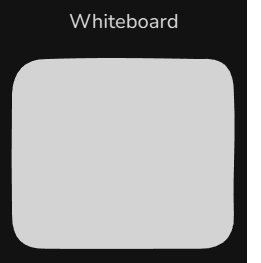
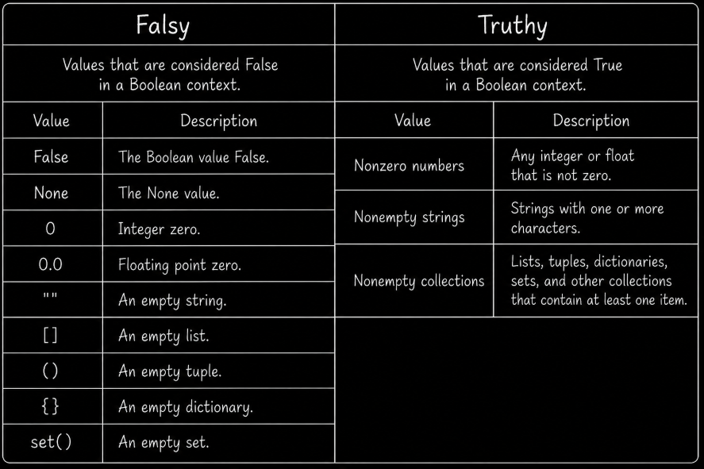

# Table of Contents: Python Data Types Level 1

- [Mutable vs Immutable](#mutable-vs-immutable)
- [Ordered vs Unordered](#ordered-vs-unordered)
- [Core built-in data types](#core-built-in-data-types)
- [Type casting](#type-casting)

**Python Data Types Level 1** introduces the basic kinds of values used in Python and several important ways to describe them. You will learn the difference between **mutable** and **immutable** objects, understand what **ordered** and **unordered** mean, explore the core built-in data types used for numbers, text, Boolean values, and the absence of a value, and perform basic **type casting**.

## Mutable vs Immutable

Python objects can be categorized by whether their contents can be changed after the object has been created.

**Mutable types** can be modified in place. They are similar to a **whiteboard**, where the existing content can be erased or changed without replacing the whiteboard itself. Python collection types such as `list`, `dict`, and `set` are mutable. These collection types are covered in more detail in **Python Data Types Level 2**.



**Immutable types** cannot be changed after they are created. They are similar to a **printed page**. The page itself cannot be edited after printing, so producing different content requires a new page. In Python, an operation that appears to change an immutable value creates or assigns a different object instead of modifying the original object in place.

Common immutable types include `int`, `float`, `complex`, `bool`, `str`, `tuple`, `NoneType`, and `frozenset`. The collection types `tuple` and `frozenset` are covered in more detail in **Python Data Types Level 2**.


Immutability matters because immutable objects can be used safely in situations where a value must remain stable. Some immutable objects are also **hashable**, which allows them to be used as dictionary keys or set elements. For example, a tuple containing only hashable values can be a dictionary key, while a list cannot.

!!! note "Reassignment is different from mutation"

    Mutable and immutable describe whether an object can be changed in place. Reassigning a variable is different because the variable can be made to refer to another object regardless of whether the original object is mutable or immutable.

Mutability describes whether an object can change. Another important characteristic of Python data types is how their elements are organized, which leads to the distinction between **ordered** and **unordered** types.

## Ordered vs Unordered

Python collection and sequence types can also be described by whether they preserve a defined order and how their elements are accessed.

**Ordered types** such as `list`, `tuple`, and `str` preserve the position of their elements. They are similar to a **bookshelf**, where each book has a specific place. These types support position based access through an `index`. The collection types `list` and `tuple` are covered in more detail in **Python Data Types Level 2**.


**Unordered or non-indexed types** such as `set` do not provide position based access through indexes. A set is more like a **box of toys**, where you work with the items themselves rather than asking for an item at a particular position. Sets are covered in more detail in **Python Data Types Level 2**.


Dictionaries are also not accessed by numeric position. Instead, a `dict` stores values associated with **keys**, and those keys are used to retrieve the corresponding values. Modern Python dictionaries preserve insertion order, but they are still key based mappings rather than index based sequences. Dictionaries are covered in more detail in **Python Data Types Level 2**.

## Core Built-in Data Types

Python provides several built-in data types for representing common kinds of information. At this level, the focus is on **numeric values**, **text**, **Boolean values**, and the **absence of a value**.

Python represents numbers using the built-in types `int`, `float`, and `complex`. These types are **immutable**. An `int` represents a whole number such as `42` or `-7`, while a `float` represents a floating point number such as `3.14` or `-0.001`.

Python also provides the `complex` type for **complex numbers**. A complex number contains a **real part** and an **imaginary part**. In Python, the imaginary part is written using `j`. For example, `2 + 3j` contains the real part `2` and the imaginary part `3j`.

```py
# Integer literals
integer_literal = 30
negative_integer = -7

# Floating point literals
floating_literal = 19.99
negative_float = -0.001

# Underscores can improve readability in numeric literals
large_integer = 1_000_000
large_float = 1_234.56

# Complex number literal
complex_number = 2 + 3j

print(complex_number)  # (2+3j)
```

At this level, `int` and `float` are the numeric types you will use most often. The `complex` type is more specialized and is commonly used in mathematical, scientific, and engineering calculations. The important idea here is to recognize `complex` as a built-in numeric type and understand its basic form. Numeric values support arithmetic operations such as addition, subtraction, multiplication, and division, which are explored in more detail in the Python operations material.

Numbers are only one kind of information that programs work with. Programs also frequently need to store and process **text**. The `str` type represents text as an ordered sequence of characters and is **immutable**, which means its characters cannot be changed in place after the string has been created. Strings can be created with single quotes, double quotes, or triple quotes. Triple quoted strings can also span multiple lines.

```py
double_quotes = "Hello"
single_quotes = 'Hello'
triple_quotes = """Hello"""
```

Strings support operations such as **concatenation**, which joins strings together, and **slicing**, which extracts part of a string. More detailed string operations are introduced later in the course.

While numbers and strings represent quantities and text, programs also need to represent whether something is **true or false**. Python uses the immutable `bool` type for this purpose, which has the two values `True` and `False`.

```py
example_boolean_true = True
example_boolean_false = False
```

Python can also interpret non-Boolean values as true or false. This property is known as **truthiness**. Values such as `False`, `None`, numeric zero, and empty strings or collections are **falsy**. Most nonzero numbers and nonempty strings or collections are **truthy**.



The `bool()` constructor can be used to see the Boolean interpretation of a value.

```py
print(bool(0)) # False
print(bool("")) # False
print(bool(None)) # False

print(bool(10)) # True
print(bool("Python")) # True
```

Logical operators and more detailed uses of truthiness are covered later in the Python operations material.

Sometimes a program needs to indicate that **no value is currently present**. Python provides `None` for this purpose. `None` represents the **absence of a value**, is the single value of the `NoneType` type, and is immutable.

```py
example_none = None
```

`None` is different from values such as `False`, `0`, and `""`. Those values represent actual Boolean, numeric, or text values, while `None` represents the absence of a value.

```py
print(None == False) # False
print(None == 0) # False
print(None == "") # False
```

## Type casting

Sometimes a value needs to be represented using a different data type. Python provides built-in constructors such as `float()`, `int()`, `str()`, and `bool()` that can perform **type conversion**, also called **type casting**. The `float()` constructor can convert an integer or a suitable numeric string to a floating point number, while `int()` can convert an integer-like string or a floating point number to an integer. The `str()` constructor produces a string representation of a value, while `bool()` produces its Boolean interpretation.

```py
# Original values
integer_value = 5
floating_value = 3.14
another_integer = 42
text_value = "hello"
empty_string = ""

# Type casting
converted_float = float(integer_value)
converted_integer = int(floating_value)
converted_string = str(another_integer)
boolean_nonempty = bool(text_value)
boolean_empty = bool(empty_string)

# Results
print(converted_float) # 5.0
print(converted_integer) # 3
print(converted_string) # 42
print(boolean_nonempty) # True
print(boolean_empty) # False
```

When `int()` converts a floating point number, it **truncates toward zero** rather than rounding to the nearest whole number.

```py
print(int(3.99)) # 3
print(int(-3.99)) # -3
```

Type casting only works when the source value can be converted to the requested type. For example, a string containing digits can be converted to an integer.

```py
number_text = "42"
number = int(number_text)

print(number) # 42
```

A string such as `"hello"` does not represent an integer, so attempting to convert it with `int()` raises a `ValueError`.

```py
number = int("hello") # ValueError
```

> **Note:** A failed conversion stops normal execution unless the error is handled. Error handling is introduced later in the course. At this level, the important idea is that not every value can be converted to every type.
